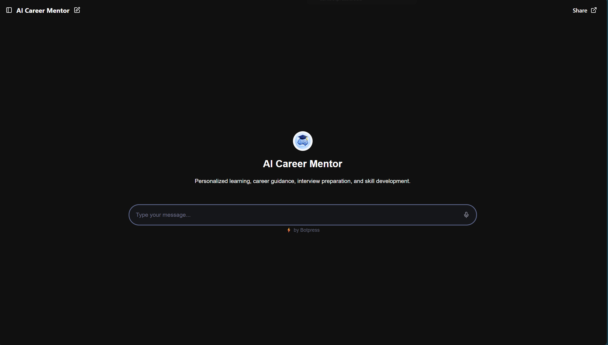
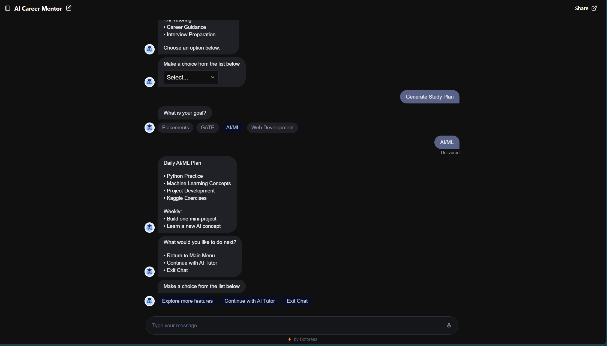
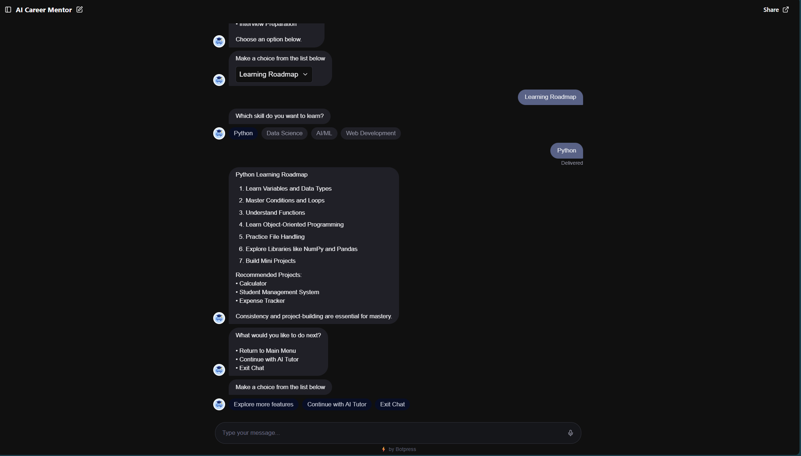
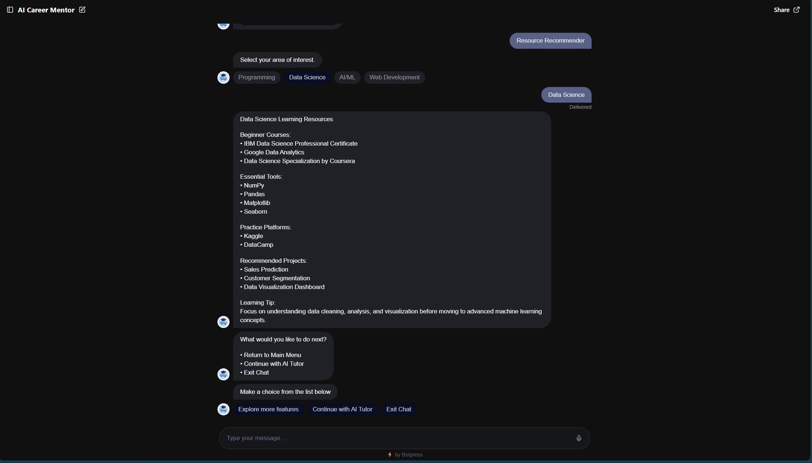
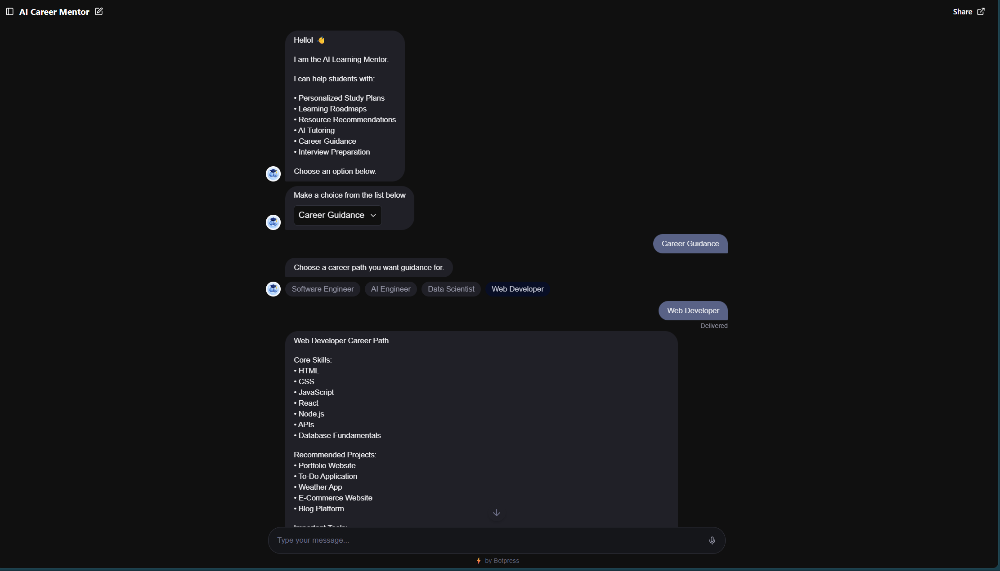
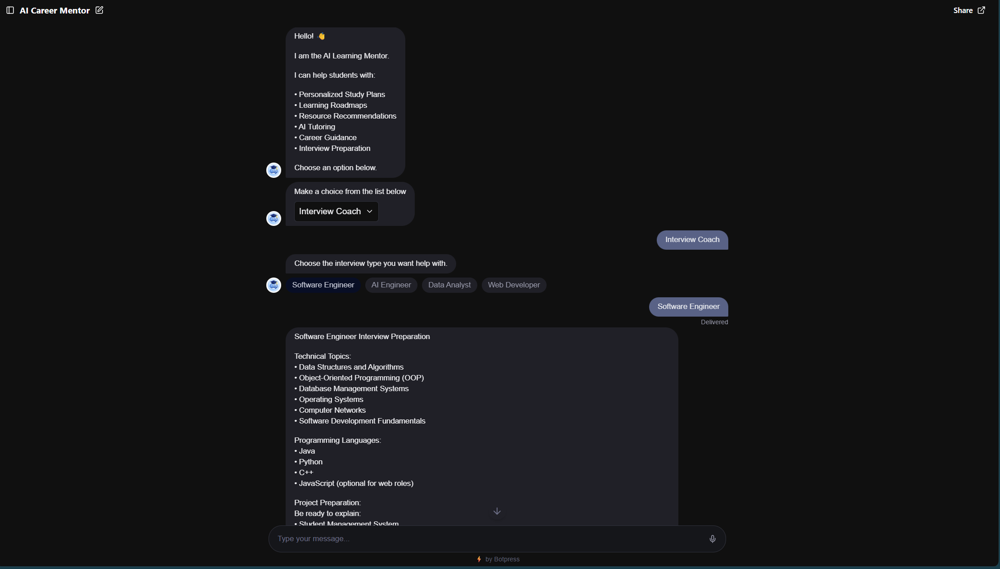
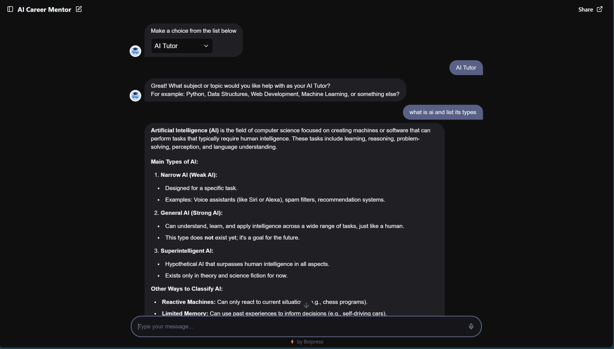
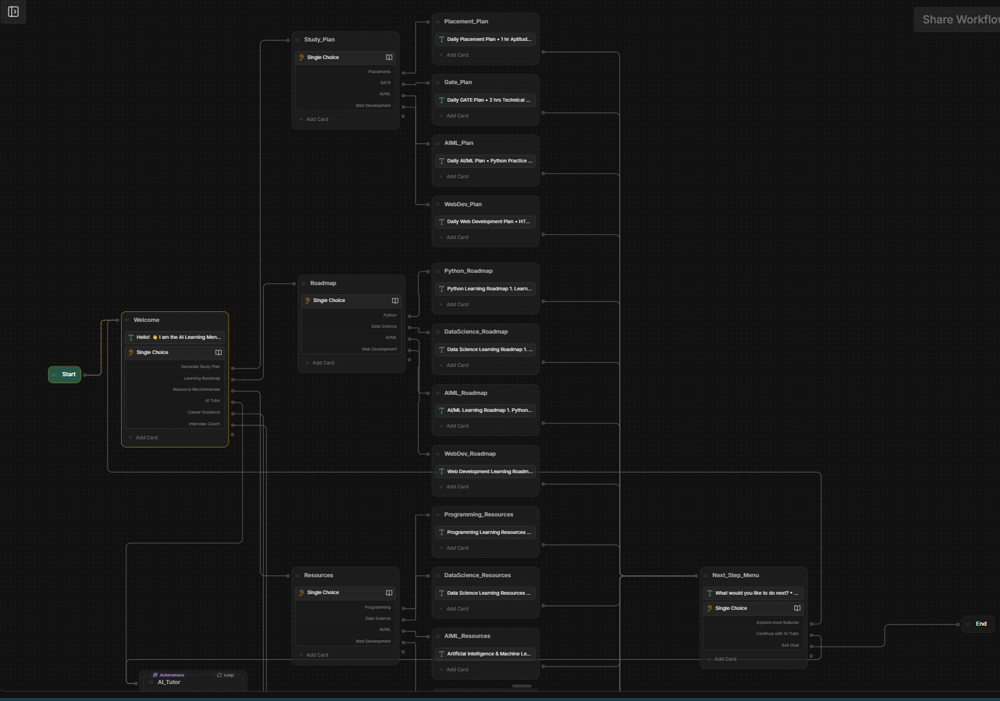
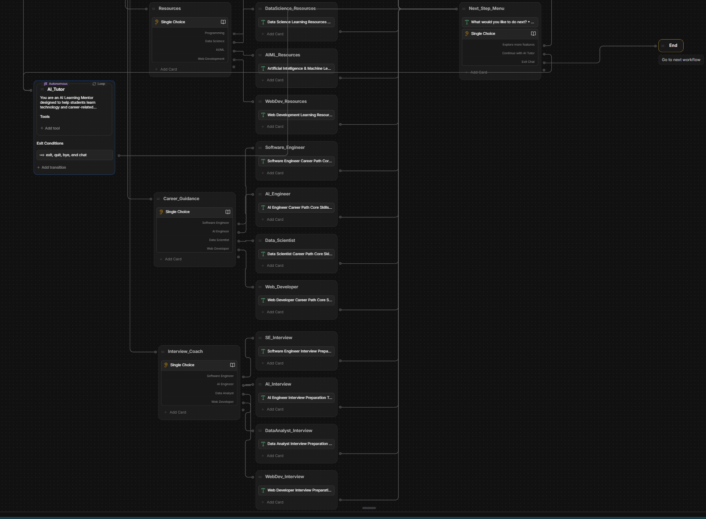

# AI Career Mentor

## Overview

AI Career Mentor is an AI-powered educational chatbot developed using Botpress to support SDG 4: Quality Education.

The chatbot helps students with:

- Personalized Study Plans
- Learning Roadmaps
- Resource Recommendations
- Career Guidance
- Interview Preparation
- AI Tutoring

---

## SDG Alignment

### SDG 4 – Quality Education

This project aims to improve access to educational guidance and learning support through conversational AI.

---

## Features

### Study Plans

Generate structured plans for:

- Placements
- GATE
- AI/ML
- Web Development

### Learning Roadmaps

Step-by-step learning paths for:

- Python
- Data Science
- AI/ML
- Web Development

### Resource Recommendations

Curated learning resources and platforms.

### Career Guidance

Career paths and skill requirements for:

- Software Engineer
- AI Engineer
- Data Scientist
- Web Developer

### Interview Coach

Technical interview preparation support.

### AI Tutor

Interactive AI assistant for educational questions.

---

## Screenshots

### Homepage

### Study Plan

### Learning Roadmap

### Resource Recommendations

### Career Guidance

### Interview Coach

### AI Tutor

---

## Workflow Architecture

---

## Technology Stack

- Botpress
- Generative AI
- NLP
- GitHub

---

## Future Scope

- Resume Analyzer
- Mock Interview System
- Progress Tracking
- Voice Assistant
- Mobile Application
